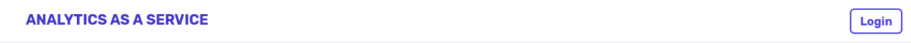
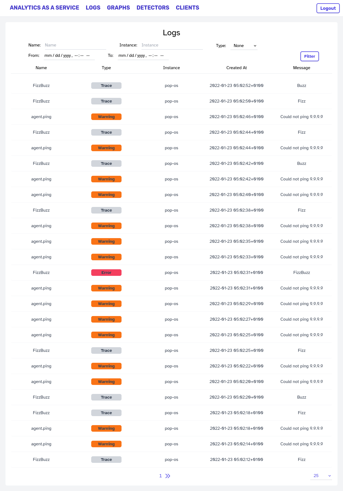
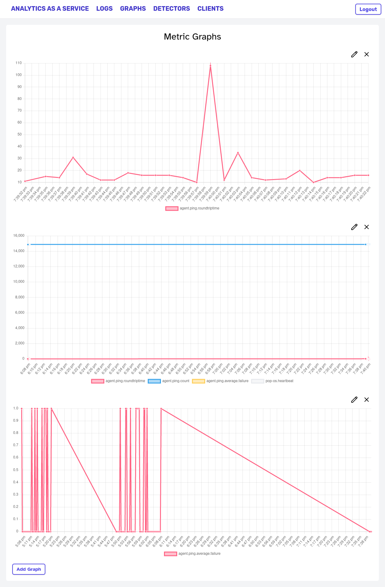
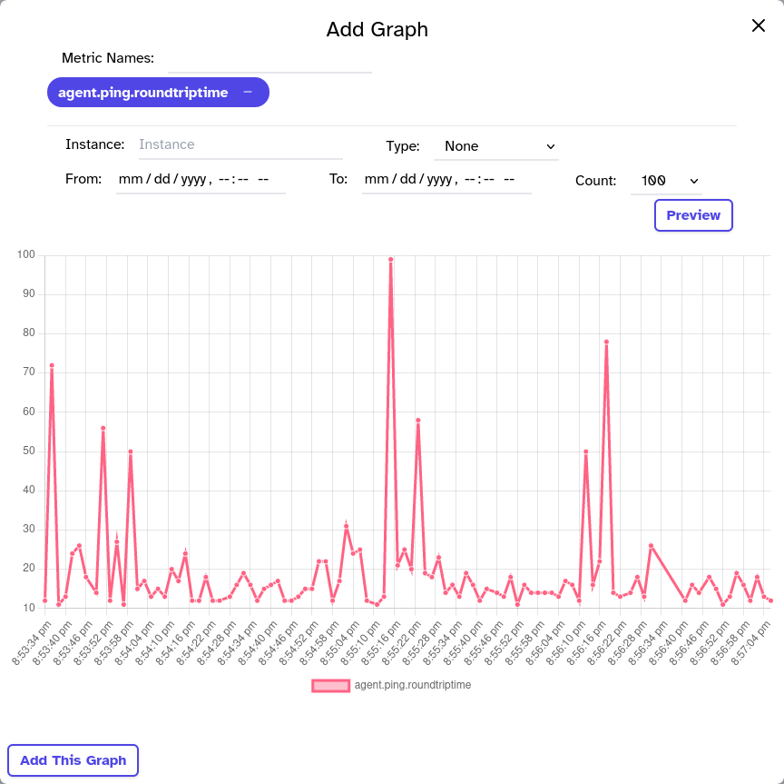
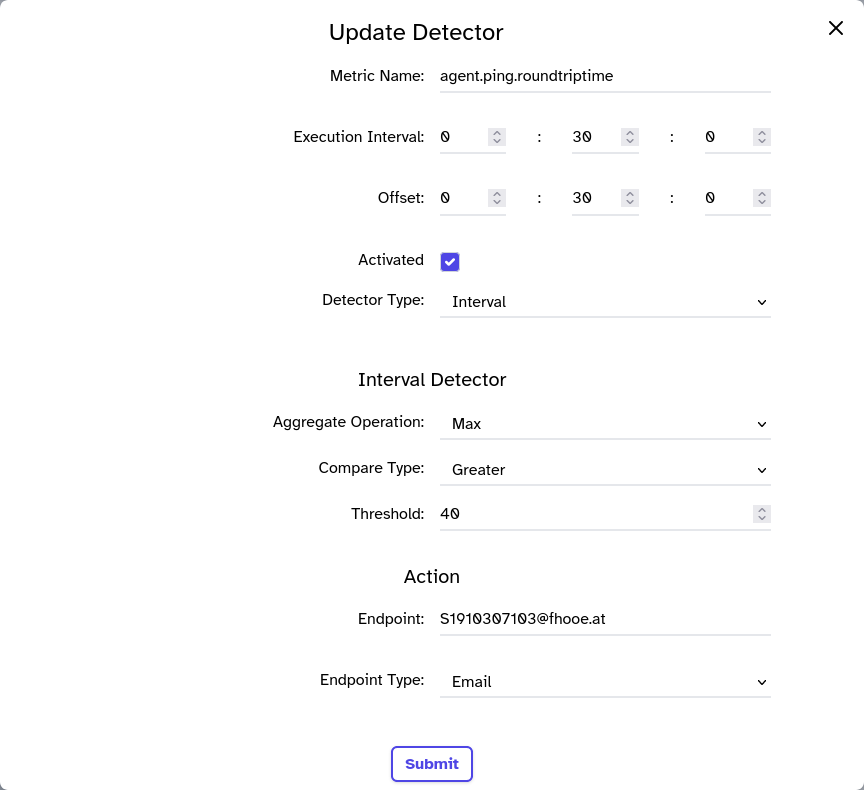
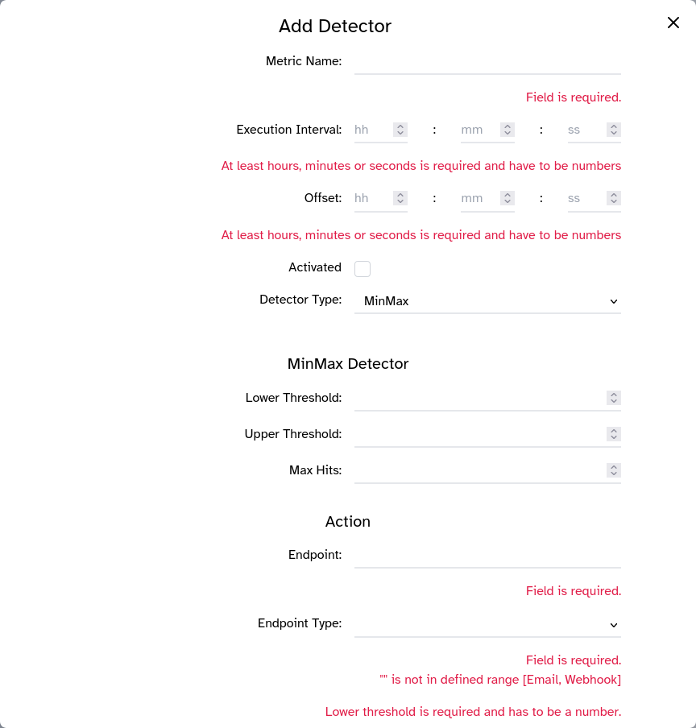
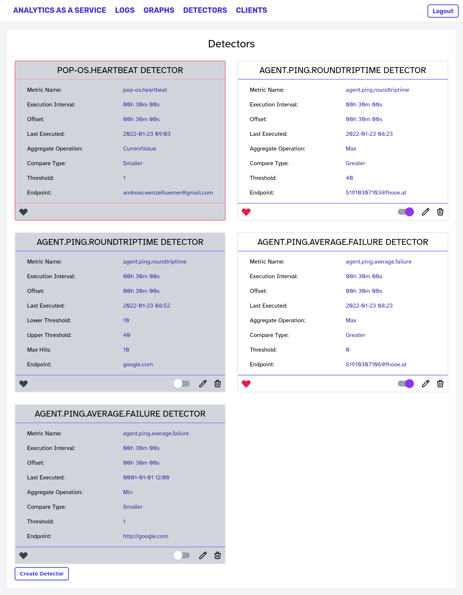
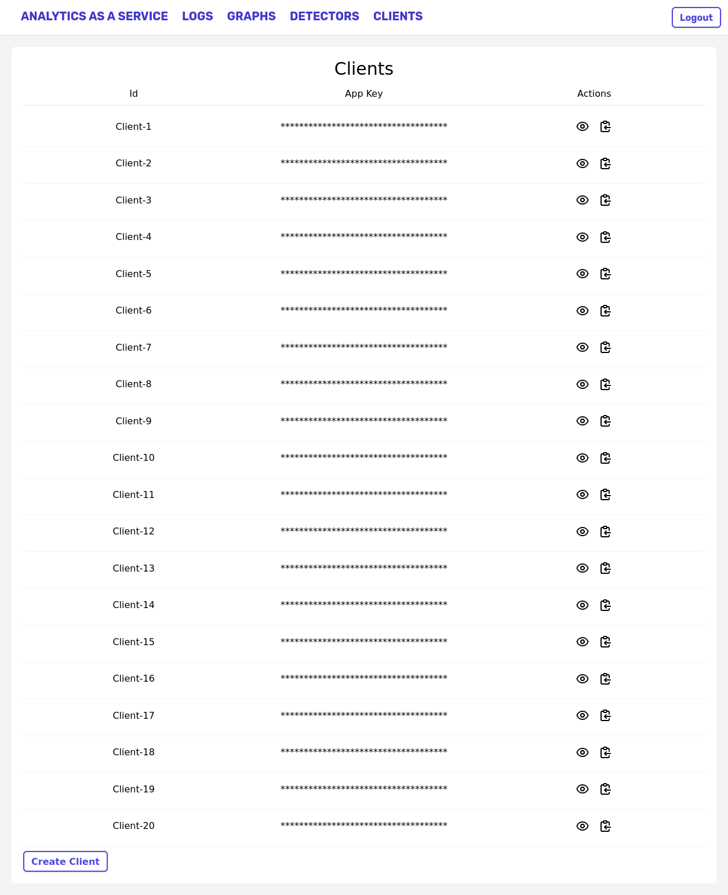

= Analytics as a Service
:author: Florian Weingartshofer
:email: <S1910307103@students.fh-hagenberg.at>
:reproducible:
:experimental:
:listing-caption: Listing
:source-highlighter: rouge
:rouge-style: github
:toc:
:sectnums:
:sectnumlevels: 6
:toclevels: 6
// Variables
:img: ./img
:imagesoutdir: ./out

<<<
== Aufwand
Aufwand liegt bei ca. 30h.

== Dependencies
Wichtige Dependencies sind:

- `tailwindcss`: Functional CSS Library
- `chartjs`: Charting Library
- `angular-oauth2-oidc`: Für Authentication

.package.json
[source,json]
----
include::../package.json[]
----

<<<
== Installationsanleitung
Schritt für Schritt:

. https://github.com/swk5-2021ws/vz-aaas-g2-weingartshofer-g1-wenzelhuemer[AaaS.API] starten
. `docker run -it -e KEYCLOAK_USER=aaas -e KEYCLOAK_PASSWORD=aaas --name keycloak -p 8080:8080 -d jboss/keycloak`: Keycloak starten
. `npm ci`: installiert die Dependencies ohne sie zu aktualisieren
. `npm start`: Webserver wird auf `4200` gestartet
. http://localhost:4200[]

Zum Konfigurieren des Ganzen wurde `environment.ts` benutzt.
Hier können auch alle Endpunkte für API oder Keycloak geädnert werden.

.environment.ts
[source,typescript]
----
include::../src/environments/environment.ts[]
----

== Aufbau des Projektes
Das Angular Projekt wurde wie folgt strukturiert:

.Structure
[plantuml, format=svg, opts="inline"]
----
skinparam Legend {
	BackgroundColor transparent
	BorderColor transparent
}
legend
AaaS.Web/src/app
|_ components: Beinhaltet alle Angular/UI Komponenten
|_ services: Service für REST, LocalStorage und für Loading-Animation
|_ model: Interfaces und Enums
|_ pipes: Pipes zum Formattieren von AppKeys und Timespans
|_ validators: Validatoren für bestimmte Reactive-Forms
|_ guards: AuthGuard
|_ interceptors: Interceptor für HttpRequests zum Aktivieren der Loading-Animation
|_ utils: Convinience-Functions
end legend
----

.Model
[plantuml]
----
include::./img/diagram.puml[]
----

.Components
[plantuml]
----
include::./img/components.puml[]
----

Nachdem Tailwind benutzt wurde, sind einige Standard-Komponenten wie bei angular-material nicht verfügbar.
Da ich allerdings schon einige Erfahrung mit Angular hatte, wollte ich auch was zusätzlich neues ausprobieren.
Daher gibt es eigene Implementierungen für Modals und Toasts.

<<<
== Übersicht der Komponenten
=== Navbar
Navigation und Login/Logout

.Navbar logged-in
image::img/navbar.png[]

.Navbar logged-out

<<<
=== Logs
Ein einfacher Log-Overview, mit Filter-Komponente, diese filtert die Logs nach gewissen Kriterien.

.Logs

<<<
=== Metrics
Metrics ist die Kernkomponente von AaaS.Web, es zeigt verschiedene Graphen an.
Es können wieder Graphen hinzugefügt, bearbeitet und gelöscht werden.

.Metrics

Zum Erstellen von neuen Graphen gibt es ein Modal, welches auf einem Reactive Form basiert und einen Preview von dem neuen Graphen anzeigt.
Der Modal zum Editieren von bestehenden Graphen sieht ident aus.
Das Reactive Form nutzt Autocomplete, um Vorschläge zu geben.
Es können natürlich mehre Metriken angegeben werden, um diese in einem Graphen anzeigen zu können, oder es wird der Metrik-Filter komplett weggelassen um wirklich alle Metriken sehen zu können.

.New Graph

Die Graphen werden alle im Local-Storage gespeichert, und werden nicht am Backend persistiert.

<<<
=== Detectors
Hier werden alle Detectors, inklusive Heartbeat Detektoren angezeigt.
Heartbeat-Detektoren sind dafür zuständig zu überprüfen, ob eine Instanz eines Clients noch aktiv ist.
Daher werden diese extra gekennzeichnet und können nicht editiert werden.
Diese können wieder bearbeitet, erstellt oder gelöscht werden, mit bestimmten Einschränkungen.
Aktivierte Detektoren werden mit einem roten Herz gekennzeichnet.
Zusätzlich gibt es einen einfachen Toggle um Detektoren deaktivieren und aktivieren zu können.

Bestehende Detektoren können bearbeitet werden.
Das Form ist wieder ein Reactive Form, welches mit eigenen Validatoren validiert wird.

.Update Detector

Für neue Detektoren gibt es wieder ein eigenes Form, welches auch validiert wird.

.new Detector With Errors

.Detectors

<<<
=== Clients
Zuletzt noch eine Übersicht von Clients und deren AppKeys.
AppKeys werden standardmässig versteckt angezeigt und die Klartext Ansicht muss getogglt werden.
AppKeys können auch einfach kopiert werden ohne sie explizit anzeigen zu müssen.

.Clients

Einen neuen Client zu erstellen ist auch sehr einfach:

.New Client

<<<
=== Toasts
Zum Darstellen von Error-Messages oder auch Success-Messages wurde eine Toast-Komponente und ein dazugehöriger Service implementiert.

.toast-service
[source,typescript]
----
include::../src/app/services/toast.service.ts[]
----

.toast-component
[source,typescript]
----
include::../src/app/components/toast/toast.component.ts[]
----

<<<
== Authentifizierung
Es wird ein eigener Keycloak-Server verwendet, da dieser sehr einfach zu starten ist.
Die Konfiguration wurde zum Teil mit dem `environment.ts` gelöst.

.auth.config.ts
[source,typescript]
----
include::../src/app/auth.config.ts[]
----

Für Zugriffe etc wurde ein eigner auth-service erstellt.

.auth-service
[source,typescript]
----
include::../src/app/services/auth.service.ts[]
----

<<<
== Loader-Interceptor
Der Interceptor zeigt eine Lade-Animation an während die Daten geladen werden.

.loader-service
[source,typescript]
----
include::../src/app/services/loader.service.ts[]
----

.loader-interceptor
[source,typescript]
----
include::../src/app/interceptors/loader.interceptor.ts[]
----

